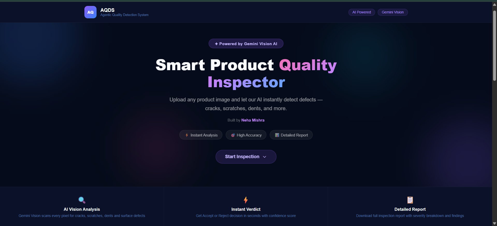
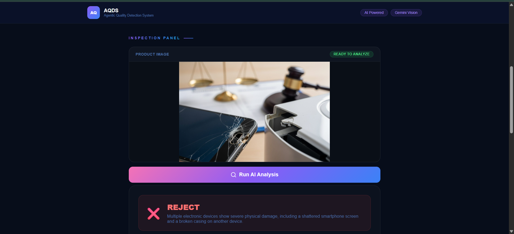
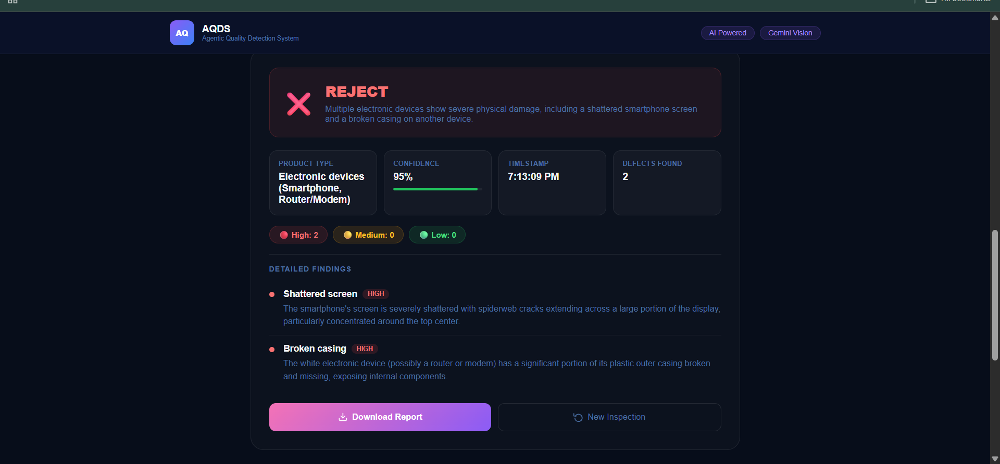
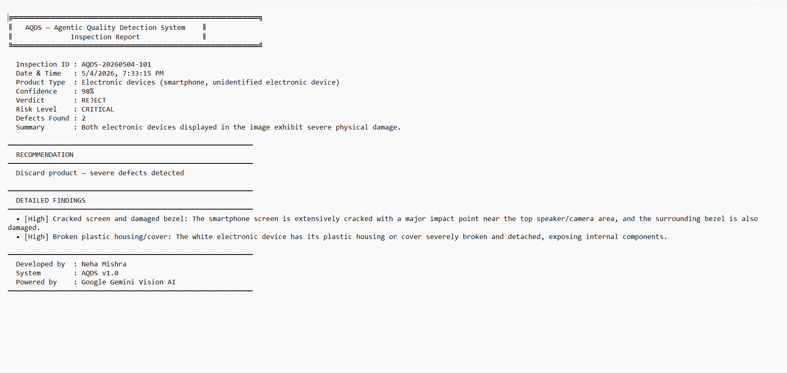
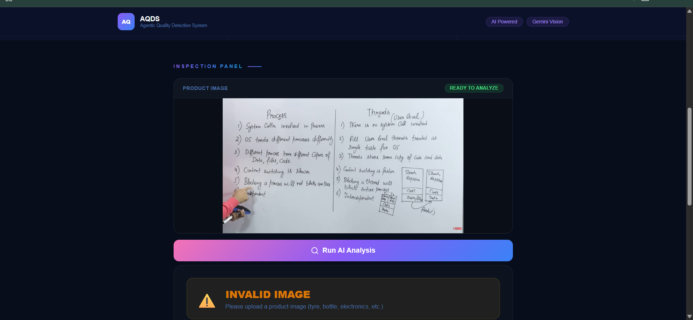
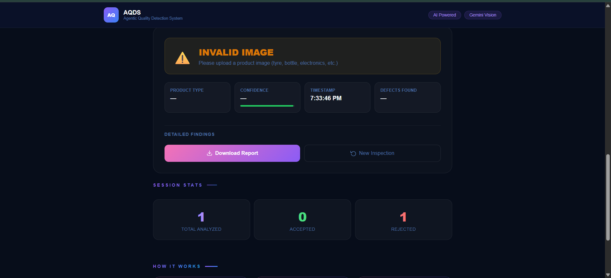

# AQDS — Agentic Quality Detection System

> Automated visual inspection for manufacturing lines. Upload a product image, get an instant defect analysis.

---

## What is this?

Manual quality inspection is slow, inconsistent, and expensive. AQDS replaces that process with a browser-based tool that analyzes product images using Google Gemini Vision AI — returning an **Accept / Reject / Invalid** verdict in seconds, complete with defect breakdown, confidence score, and a downloadable inspection report.

No backend. No setup. Just open and inspect.

---

## Objectives

- Reduce manual inspection effort in manufacturing and production environments
- Improve defect detection accuracy by leveraging AI vision capabilities
- Speed up quality control processes with instant automated verdicts
- Make quality inspection accessible without specialized hardware or software

---

## Features

| Capability | Details |
|---|---|
| 🤖 AI Defect Detection | Powered by Gemini 2.5 Flash Vision API |
| ✅ Instant Verdict | Accept / Reject / Invalid with confidence score |
| 🔴 Severity Breakdown | High / Medium / Low defect classification |
| 📋 Inspection Report | Downloadable report with Inspection ID, Risk Level & Recommendations |
| 📊 Session Statistics | Live tracking of accepted, rejected, and invalid results |
| 🖼️ Image Preview | Drag & drop upload with instant preview |
| 🚫 Invalid Detection | Filters out non-product or unreadable images |

---

## How It Works

```
User uploads image
       ↓
Image → base64 → Gemini 2.5 Flash Vision API
       ↓
AI scans for: cracks · scratches · dents · discoloration · missing parts
       ↓
Verdict + Confidence Score + Severity Breakdown
       ↓
Downloadable Inspection Report generated
```

---

## Tech Stack

```
Frontend     →   HTML5 · CSS3 · Vanilla JavaScript
AI / Vision  →   Google Gemini 2.5 Flash API
Hosting      →   GitHub Pages
Version Ctrl →   Git & GitHub
```

No frameworks. No build tools. Runs entirely in the browser.

---

## Screenshots

**Main Interface**



**Valid Image — Upload & Analysis**





**Sample Inspection Report**



**Invalid Image — Detection & Analysis**





---

## Project Structure

```
AQDS-System/
├── .gitignore
├── index.html              # Main application
├── style.css               # Dark theme UI
├── README.md
├── progress.md             # Development log
└── screenshots/
    ├── Website-UI.png
    ├── valid-image.png
    ├── valid-image-analysis.png
    ├── invalid-image.png
    ├── invalid-image-analysis.png
    └── report-card.png

---

## Current Status — Phase 1 Complete ✅

- [x] Dark theme UI with drag & drop upload
- [x] Gemini Vision API integration  
- [x] Accept / Reject / Invalid verdict engine
- [x] Confidence score with visual progress bar
- [x] Severity breakdown — High / Medium / Low
- [x] Detailed findings with defect descriptions
- [x] Downloadable inspection report (.txt)
- [x] Session statistics tracking
- [x] Invalid image detection with descriptive feedback
- [x] Hero section with scroll-to-inspection button

> ⚠️ **Note:** API key secured locally. Full secure deployment planned in Phase 2 with backend integration.

---

## Roadmap

### 🔄 Phase 2 — Backend & Storage *(Planned)*
- Python Flask / Node.js backend
- Secure API key management via server
- MongoDB for inspection history & logs
- User authentication — login / signup
- Batch image processing

### 🔬 Phase 3 — Custom ML Model *(Planned)*
- YOLOv11 for real-time object detection
- Custom dataset of defective product images
- CNN model trained for specific defect types
- Live camera feed for production line analysis

### 🏭 Phase 4 — Full Industrial System *(Planned)*
- IoT integration — Raspberry Pi / Arduino
- Conveyor belt auto-rejection mechanism
- Analytics dashboard — weekly / monthly reports
- Email / SMS alerts for supervisors
- React Native mobile app
- Cloud deployment — AWS / Google Cloud

---

## Built By

**Neha Mishra**  
B.Tech CSE — 2nd Year  

[](https://github.com/Neha134-gif/AQDS-System)